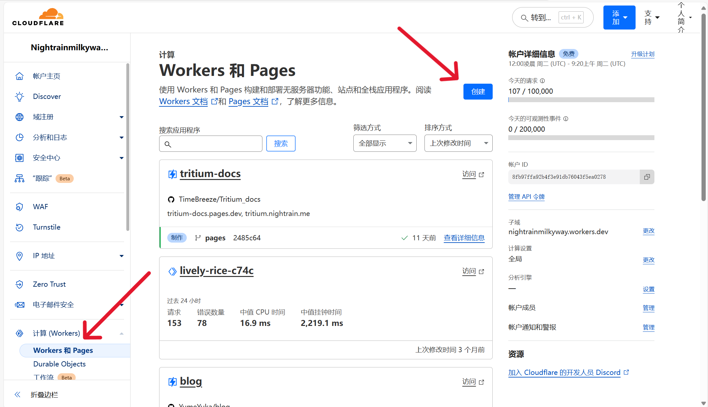
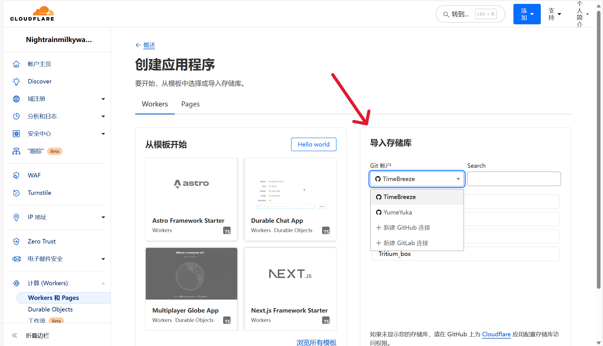
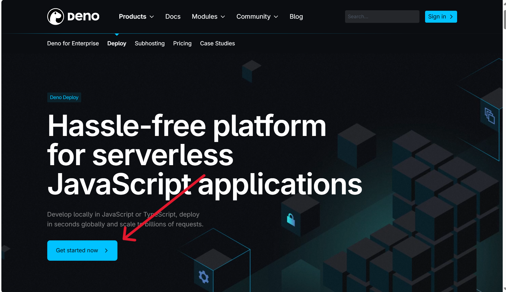
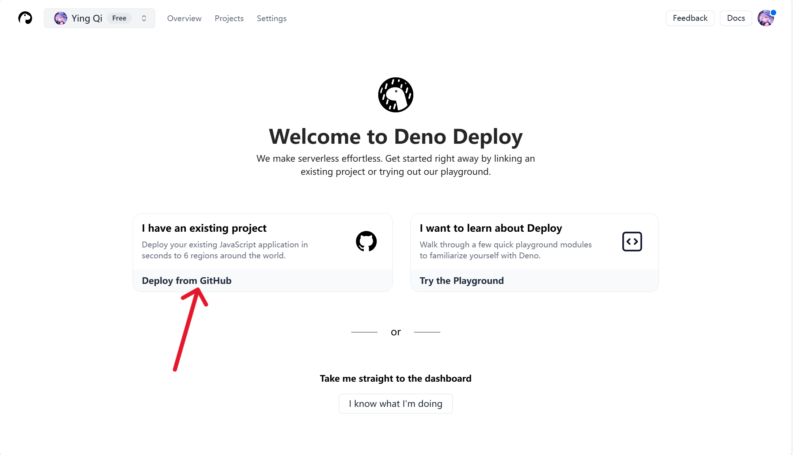
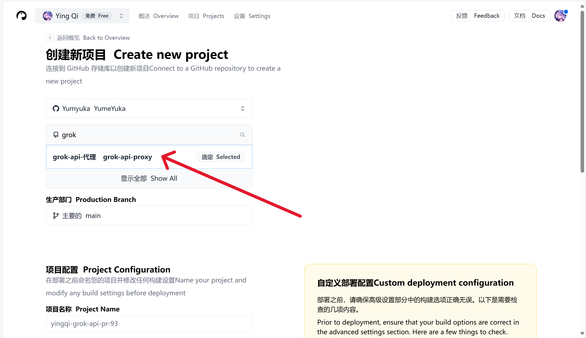
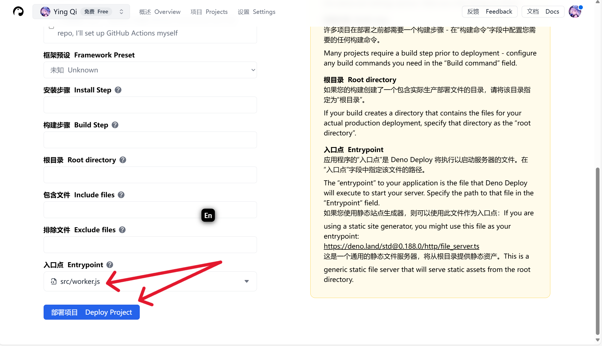

# Grok API 代理

一个简单的脚本，为了解决地区受限制无法使用grok的api调用，用作 x.ai API 的代理。此脚本处理用户请求并将所有其他请求转发到 x.ai API。

## 功能

* 代理请求到 `https://api.x.ai`

## 部署到 Cloudflare Workers

Fork 此仓库    

> [!TIP]
> 点击下面的按钮，登陆账号，然后选择`workers-and-pages`，点击创建，选择导入储存库，选择复刻的仓库，一键部署就可以调用了

## 部署到 Deno

Fork 此仓库 

> [!TIP]
> 点击下面的按钮，登陆账号，然后授权Github，选择复刻的仓库，选择主文件为`src/worker.js`一键部署就行了

## 具体操作
### Cloudflare

### Deno

## License

**[MIT license](LICENSE)**